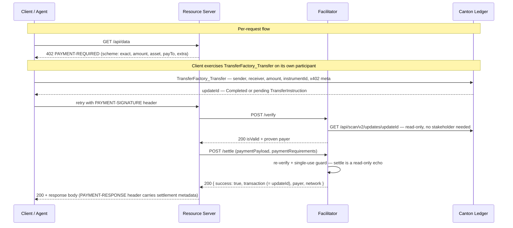

# Exact Payment Scheme for Canton Network (`exact`)

This document specifies the `exact` payment scheme for the x402 protocol on
Canton Network. Payments use the CIP-56 `TransferFactory_Transfer` primitive;
the facilitator verifies read-only via SV Scan and does not submit on-ledger
settlement transactions.

## Scheme Name

`exact`

> **Reference stack note:** The FTP reference stack (`@ftp/x402-canton-*`) currently
> uses `exact-canton` as its external package scheme name. The upstream canonical
> form is `scheme: "exact"` with `network: "canton:*"` identifiers.

## Networks

Canton Network is a Daml-based network using the Global Synchronizer.

CAIP-2-style identifiers:

| Network | Identifier | Notes |
|---|---|---|
| Canton TestNet | `canton:testnet` | Public test network |
| Canton MainNet | `canton:mainnet` | Production network |

## Protocol Flow

Canton x402 settles **on-ledger**: the payer exercises a CIP-56
`TransferFactory_Transfer` on its own participant, and the facilitator verifies
it by reading the **SV Scan API** (read-only; on RBAC-gated deployments the
facilitator authenticates to Scan, no stakeholder status required). When the
merchant holds a `TransferPreapproval` the transfer completes synchronously;
otherwise it lands as a pending `TransferInstruction`.



## PaymentRequirements

A 402 response includes one or more entries in its `accepts[]` array.
Below is the canonical form.

```json
{
  "scheme": "exact",
  "network": "canton:mainnet",
  "amount": "1000000000",
  "asset": "canton-coin",
  "payTo": "merchant_party::1220abc...",
  "maxTimeoutSeconds": 60,
  "extra": {
    "transferMethod": "cip56-transfer-factory",
    "facilitatorParty": "ftp_facilitator::1220def...",
    "synchronizerId": "global-domain::1220xyz...",
    "transferFactoryCid": "00factory...",
    "transferFactoryTemplateId": "<pkg-hash>:Splice.Api.Token.TransferInstructionV1:TransferFactory",
    "instrumentId": { "admin": "DSO::1220...", "id": "Amulet" },
    "memo": "optional invoice id"
  }
}
```

### Field semantics

- `amount` — atomic units, JSON string for precision. Canton Coin uses
  10 decimals (so `"1000000000"` = 0.1 CC). For CIP-56 tokens, atomic
  units of the instrument's declared `decimals`.
- `asset` — `"canton-coin"` for Splice Amulet, or
  `"<adminParty>::<id>"` for a CIP-56 token instrument.
- `payTo` — receiver party id in canonical form `"<name>::<fingerprint>"`.
- `extra.transferMethod` — MUST be `cip56-transfer-factory` (the only method).
  Absent is treated as `cip56-transfer-factory`.
- `extra.facilitatorParty` — the facilitator's own party id. Clients stamp it
  into `Transfer.meta["x402.facilitatorParty"]`.
- `extra.synchronizerId` — the Global Synchronizer the transfer settles on.
- `extra.transferFactoryCid` / `extra.transferFactoryTemplateId` — the CIP-56
  `TransferFactory` (cid + hash-prefixed template id) the client exercises.
- `extra.instrumentId` — `{admin, id}` of the token instrument (e.g.
  `{admin: "DSO::1220…", id: "Amulet"}` for Canton Coin).
- `extra.memo` (optional) — opaque text for the merchant's records. Maximum
  256 bytes.

### Transfer Methods

This specification defines one on-ledger path.

| Method | On-ledger primitive |
|---|---|
| `cip56-transfer-factory` | `Splice.Api.Token.TransferInstructionV1.TransferFactory_Transfer` + `TransferPreapproval` |

The `cip56-transfer-factory` method supports Canton Coin (Amulet) and any other
CIP-56 instrument. For Canton Coin: `asset: "canton-coin"`,
`extra.instrumentId: { admin: "DSO::1220...", id: "Amulet" }`.

## PaymentPayload

The client constructs the on-ledger transfer first, then sends the `payload` to
the facilitator. The facilitator does NOT submit on the client's behalf — the
client's own key authorizes the `TransferFactory_Transfer` exercise.

### Full PAYMENT-SIGNATURE header shape (x402 v2)

```json
{
  "x402Version": 2,
  "resource": {
    "url": "https://api.example.com/data",
    "description": "Access to protected resource",
    "mimeType": "application/json"
  },
  "accepted": {
    "scheme": "exact",
    "network": "canton:mainnet",
    "amount": "1000000",
    "asset": "issuer::1220abc...::USDC",
    "payTo": "merchant_party::1220def...",
    "maxTimeoutSeconds": 60,
    "extra": {
      "transferMethod": "cip56-transfer-factory",
      "facilitatorParty": "ftp_facilitator::1220...",
      "synchronizerId": "global-domain::1220xyz...",
      "transferFactoryCid": "00factory...",
      "transferFactoryTemplateId": "<pkg-hash>:Splice.Api.Token.TransferInstructionV1:TransferFactory",
      "instrumentId": { "admin": "issuer::1220abc...", "id": "USDC" }
    }
  },
  "payload": {
    "transferMethod": "cip56-transfer-factory",
    "payerParty": "agent_party::1220...",
    "updateId": "1220abc..."
  }
}
```

Example uses a generic CIP-56 token. Canton Coin (Amulet) is also supported
via the same method with `asset: "canton-coin"` and
`instrumentId: { admin: "DSO::1220...", id: "Amulet" }`.

### `payload` field variants

Two variants depending on whether the registry returned
`TransferInstructionResult_Completed` (synchronous; tokens already moved) or
`TransferInstructionResult_Pending` (asynchronous; instruction contract advances
later). Exactly one of `updateId` and `transferInstructionCid` MUST be set.

> A live `TransferInstruction` means tokens have **not** moved yet. A facilitator
> that reads a still-live instruction MUST NOT report settlement success. Use a
> merchant `TransferPreapproval` to ensure synchronous completion.

```json
// Completed case
{
  "transferMethod": "cip56-transfer-factory",
  "payerParty": "agent_party::1220...",
  "updateId": "1220abc..."
}

// Pending case
{
  "transferMethod": "cip56-transfer-factory",
  "payerParty": "agent_party::1220...",
  "transferInstructionCid": "00abc..."
}
```

## SettlementResponse

Returned by the facilitator from `POST /settle` on success and echoed back in
the `PAYMENT-RESPONSE` HTTP header by the resource server.

```json
{
  "success": true,
  "payer": "agent_party::1220...",
  "transaction": "00f1abc...",
  "network": "canton:mainnet",
  "amount": "1000000000"
}
```

- `transaction` — Canton ledger `updateId` of the `TransferFactory_Transfer`
  exercise (echoed; CIP-56 settle is a no-op). Resolvable in any Scan API for
  proof-of-settlement.

On failure:

```json
{
  "success": false,
  "errorReason": "invalid_exact_canton_amount_mismatch",
  "transaction": ""
}
```

## Facilitator Verification Rules (MUST)

`cip56-transfer-factory` is the only payment method. For a payment whose
`payload` carries an `updateId` (the transfer completed synchronously) the
facilitator MUST validate ALL of the following before returning `isValid: true`:

1. **Network match.** `paymentRequirements.network` equals the facilitator's
   configured network; cross-network claims are rejected.
2. **Authoritative Scan read.** Read the SV Scan API
   `GET /api/scan/v2/updates/{updateId}` and locate the exercised
   `TransferFactory_Transfer` whose
   `exercise_result.output.tag == "TransferInstructionResult_Completed"`. A
   Scan mismatch is DEFINITIVE and MUST NOT be retried through other means.
3. **Amount equality.** `transfer.amount` == PaymentRequirements.amount.
4. **Payer = sender.** The returned `payer` is the proven `transfer.sender`,
   not the client's claim.
5. **Receiver / merchant match.** `transfer.receiver` == PaymentRequirements.payTo.
6. **Instrument match.** `transfer.instrumentId.{admin,id}` == `extra.instrumentId`.
7. **Resource binding.** When the client stamped `x402.resourceUrl` into
   `transfer.meta.values`, it MUST equal `resource.url`
   (`invalid_exact_canton_resource_url_mismatch` otherwise).
8. **Single-use.** The `updateId` MUST NOT have settled before
   (`invalid_exact_canton_payment_already_settled`).

For a payment carrying a `transferInstructionCid` (still `Pending`), the
facilitator reads the `TransferInstruction`, validates
amount/sender/receiver/instrumentId, and rejects as
`invalid_exact_canton_transfer_instruction_pending` — tokens have not moved.
The payer SHOULD use a merchant `TransferPreapproval` for synchronous completion.

## Duplicate Settlement Mitigation

**Ledger-level:** A completed `TransferFactory_Transfer` is an immutable
historical on-ledger record; double-spend is impossible.

**HTTP-level:** Facilitators MUST enforce single-use settlement for each
`updateId` and reject a second settle with
`invalid_exact_canton_payment_already_settled`. The storage mechanism is
implementation-defined.

## Canton-specific: Verification via SV Scan

Canton has stakeholder-scoped contract visibility. The facilitator reads the
SV Scan API — `GET /api/scan/v2/updates/{updateId}` — and validates
`sender`, `receiver`, `amount`, `instrumentId` from the exercised
`TransferFactory_Transfer` choice argument directly. No stakeholder status
required. On RBAC-gated deployments the facilitator authenticates to Scan.

When the Scan read resolves but the transfer is invalid, the facilitator MUST
reject with the specific reason and MUST NOT retry through other means.

The facilitator matches only `TransferInstructionResult_Completed`. A
`TransferInstructionResult_Pending` result MUST NOT be accepted as settled.

## References

- [x402 v2 spec](https://github.com/x402-foundation/x402/blob/main/specs/x402-specification-v2.md)
- [SVM scheme spec (precedent)](https://github.com/x402-foundation/x402/blob/main/specs/schemes/exact/scheme_exact_svm.md)
- [`Splice.AmuletRules` (TransferPreapproval)](https://github.com/hyperledger-labs/splice/blob/main/daml/splice-amulet/daml/Splice/AmuletRules.daml)
- [CIP-56 Token Standard](https://github.com/canton-foundation/cips/blob/main/cip-0056/cip-0056.md)

## Appendix

### Privacy Considerations

- **Facilitator scope.** The facilitator validates payments through SV Scan
  and cannot see a payer's wallet balance or unrelated transactions.
- **PII in memo/description.** Avoid PII in `extra.memo`; facilitator logs
  and indexers will surface these strings.
- **Resource URL.** `x402.resourceUrl` in Transfer.meta identifies the paid
  API endpoint. Truncate or hash if sensitive.
- **PartyToKeyMapping.** The payer's signing key is visible to all
  participants on the same synchronizer.

### Network identifiers in `/supported`

A conformant Canton facilitator advertises CAIP-2-style network IDs.
Example response:

```json
{
  "kinds": [
    {
      "x402Version": 2,
      "scheme": "exact",
      "network": "canton:mainnet",
      "extra": { "transferMethods": ["cip56-transfer-factory"] }
    },
    {
      "x402Version": 2,
      "scheme": "exact",
      "network": "canton:testnet",
      "extra": { "transferMethods": ["cip56-transfer-factory"] }
    }
  ],
  "extensions": [],
  "signers": { "canton:*": ["ftp_facilitator::1220def..."] }
}
```

### Error Reason Codes

Canton-specific error codes. All MUST be prefixed `invalid_exact_canton_*`
or `unexpected_canton_*`.

| Code | Meaning |
|---|---|
| `invalid_exact_canton_transfer_not_found` | The transfer (updateId / TransferInstruction) does not resolve to a completed `TransferFactory_Transfer` on Scan. |
| `invalid_exact_canton_amount_mismatch` | `transfer.amount` != PaymentRequirements.amount. |
| `invalid_exact_canton_asset_mismatch` | Token type does not match the requirements. |
| `invalid_exact_canton_expired` | The transfer is past its `executeBefore` (or within the settle-latency margin). |
| `invalid_exact_canton_payer_mismatch` | `payload.payerParty` != the proven `transfer.sender`. |
| `invalid_exact_canton_merchant_mismatch` | `transfer.receiver` != PaymentRequirements.payTo. |
| `invalid_exact_canton_resource_url_mismatch` | `transfer.meta["x402.resourceUrl"]` != the requested resource. |
| `invalid_exact_canton_transfer_instruction_not_found` | CIP-56: `transferInstructionCid` does not resolve / facilitator is not a stakeholder. |
| `invalid_exact_canton_transfer_instruction_pending` | CIP-56: a `TransferInstruction` was found and is valid, but still pending (tokens not moved). Use a `TransferPreapproval` for synchronous completion. |
| `invalid_exact_canton_instrument_id_mismatch` | CIP-56: token `instrumentId` (admin/id) does not match PaymentRequirements. |
| `invalid_exact_canton_transfer_factory_not_found` | CIP-56: the advertised `transferFactoryCid` does not resolve. |
| `invalid_exact_canton_missing_proof` | CIP-56: neither a valid `updateId` nor `transferInstructionCid` was supplied. |
| `invalid_exact_canton_payment_already_settled` | The payment (updateId) was already settled — single-use replay protection. |
| `unexpected_canton_ledger_error` | Catch-all for Canton ledger / Scan API failures, network timeouts, etc. |
