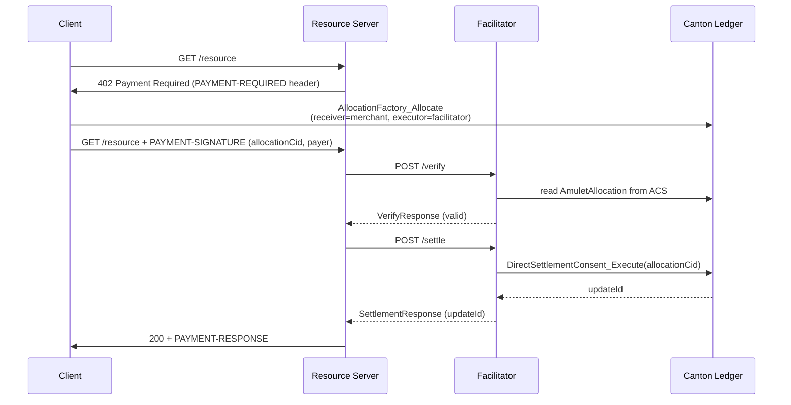

# Exact Payment Scheme for Canton Network (`exact`)

This document specifies the `exact` payment scheme for the x402 protocol
on Canton Network. The client creates an `AmuletAllocation` (CIP-56 Token
Standard) naming the merchant as receiver and the facilitator as settlement
executor; the facilitator exercises `DirectSettlementConsent_Execute` —
moving Canton Coin atomically and directly to the merchant in a single
facilitator-submitted transaction. No escrow, no facilitator custody.

## Scheme Name

`exact`

## Networks

| Network | Identifier |
|---|---|
| Canton MainNet | `canton:mainnet` |
| Canton TestNet | `canton:testnet` |
| Canton DevNet | `canton:devnet` |

## Protocol Flow

Two transactions settle each payment:

- **Tx 1 (client):** `AllocationFactory_Allocate` — locks the sender's
  Canton Coin into an `AmuletAllocation` with `receiver = merchant` and
  `settlement.executor = facilitator`.
- **Tx 2 (facilitator):** `DirectSettlementConsent_Execute` — the facilitator
  alone exercises a standing both-party consent, which runs
  `Allocation_ExecuteTransfer` and pays the merchant directly.


```mermaid
sequenceDiagram
    participant C as Client
    participant R as Resource Server
    participant F as Facilitator
    participant L as Canton Ledger

    C->>R: GET /resource
    R->>C: 402 Payment Required (PAYMENT-REQUIRED header)
    C->>L: AllocationFactory_Allocate<br/>(receiver=merchant, executor=facilitator)
    C->>R: GET /resource + PAYMENT-SIGNATURE (allocationCid, payer)
    R->>F: POST /verify
    F->>L: read AmuletAllocation from ACS
    F-->>R: VerifyResponse (valid)
    R->>F: POST /settle
    F->>L: DirectSettlementConsent_Execute(allocationCid)
    L-->>F: updateId
    F-->>R: SettlementResponse (updateId)
    R->>C: 200 + PAYMENT-RESPONSE
```

## Merchant Onboarding

Before receiving the first payment, the merchant MUST create a
`MerchantConsent {merchant, facilitator}` contract on the Canton ledger
once-total. This grants the facilitator standing authority to mint the
both-party `DirectSettlementConsent` on demand.

The sender's `SenderConsent {sender, facilitator}` is created automatically
by the client wallet relay on the first payment attempt. After both consents
exist, the facilitator mints a `DirectSettlementConsent {sender, merchant,
facilitator}` once per (sender, merchant) pair; it is reused for all
subsequent payments between that pair.

## `PaymentRequirements` for `exact`

```json
{
  "scheme": "exact",
  "network": "canton:mainnet",
  "amount": "1000000000",
  "asset": "CC",
  "payTo": "merchant_party::1220abc...",
  "maxTimeoutSeconds": 60,
  "extra": {
    "assetTransferMethod": "allocation-direct",
    "feePayer": "ftp_facilitator::1220def...",
    "synchronizerId": "global-domain::1220xyz...",
    "instrumentId": { "admin": "DSO::1220...", "id": "Amulet" },
    "allocateBeforeSeconds": 30,
    "settleBeforeSeconds": 60,
    "memo": "invoice-2024-001"
  }
}
```

- `amount`: Integer string of atomic units (1 CC = 1e10 units).
  `"1000000000"` = 0.1 CC. Must match exactly what the ledger records.
- `asset`: `"CC"`. Settles Canton Coin only.
- `payTo`: Merchant's Canton party id `"<name>::<fingerprint>"`.
- `extra.assetTransferMethod`: MUST be `"allocation-direct"`.
- `extra.feePayer`: The facilitator's Canton party id. Set as
  `settlement.executor` in the `AmuletAllocation`. Clients MUST NOT alter
  this value.
- `extra.synchronizerId`: The Global Synchronizer the transfer settles on.
- `extra.instrumentId`: The Canton Coin instrument identifier
  `{ "admin": "<DSO-party>", "id": "Amulet" }`.
- `extra.allocateBeforeSeconds`: Relative deadline (seconds from request time)
  the client uses to compute the absolute `allocateBefore` timestamp in the
  allocation.
- `extra.settleBeforeSeconds`: Relative deadline for `settleBefore`. MUST be
  strictly after `allocateBefore`.
- `extra.memo` (optional): Seller-defined UTF-8 string, max 256 bytes. When
  present, the client MUST include it in the allocation's settlement metadata.

## `PaymentPayload` `payload` Field

```json
{
  "x402Version": 2,
  "resource": {
    "url": "https://api.example.com/data",
    "description": "Access to protected resource",
    "mimeType": "application/json"
  },
  "accepted": {
    "scheme": "exact",
    "network": "canton:mainnet",
    "amount": "1000000000",
    "asset": "CC",
    "payTo": "merchant_party::1220abc...",
    "maxTimeoutSeconds": 60,
    "extra": {
      "assetTransferMethod": "allocation-direct",
      "feePayer": "ftp_facilitator::1220def...",
      "synchronizerId": "global-domain::1220xyz...",
      "memo": "invoice-2024-001"
    }
  },
  "payload": {
    "assetTransferMethod": "allocation-direct",
    "allocationCid": "00abc...",
    "payer": "agent_party::1220...",
    "directConsentCid": "00def...",
    "createUpdateId": "1220alloc..."
  }
}
```

- `allocationCid`: Contract id of the completed `AmuletAllocation` created
  by the client. The facilitator reads this from its participant ACS.
- `payer`: The client's Canton party id (`allocation.transferLeg.sender`).
- `directConsentCid` (optional): The standing `DirectSettlementConsent` cid
  for the (sender, merchant) pair. When present the facilitator uses it
  directly; when absent the facilitator resolves it from ACS.
- `createUpdateId` (optional): `updateId` of the `AllocationFactory_Allocate`
  transaction. The facilitator records it for traffic attribution. Ignored if
  absent.

## `SettlementResponse`

```json
{
  "success": true,
  "payer": "agent_party::1220...",
  "transaction": "122038abc...",
  "network": "canton:mainnet"
}
```

`transaction` is the Canton ledger `updateId` of the
`DirectSettlementConsent_Execute` exercise. Resolvable in any SV Scan API as
proof of settlement.

On failure:

```json
{
  "success": false,
  "errorReason": "invalid_exact_canton_amount_mismatch",
  "transaction": ""
}
```

## Facilitator Verification Rules (MUST)

1. **Network match.** `paymentRequirements.network` MUST equal the
   facilitator's configured network.

2. **Proof present.** `payload.allocationCid` MUST be a non-empty string.
   If only `allocationInstructionCid` is present, reject with
   `invalid_exact_canton_allocation_pending`. If neither is present, reject
   with `invalid_exact_canton_missing_proof`.

3. **Allocation exists.** The facilitator MUST locate the `AmuletAllocation`
   by `payload.allocationCid` from its participant ACS (it is an observer as
   `settlement.executor`). If absent or archived, reject with
   `invalid_exact_canton_allocation_not_found`.

4. **Amount.** `allocation.transferLeg.amount` MUST equal
   `paymentRequirements.amount` converted to on-ledger Decimal
   (1 CC = 1e10 atomic units). Reject with
   `invalid_exact_canton_amount_mismatch`.

5. **Receiver.** `allocation.transferLeg.receiver` MUST equal
   `paymentRequirements.payTo`. Reject with
   `invalid_exact_canton_merchant_mismatch`.

6. **Instrument.** `allocation.transferLeg.instrumentId` MUST match Canton
   Coin (`extra.instrumentId`). Reject with
   `invalid_exact_canton_instrument_id_mismatch`.

7. **Executor.** `allocation.settlement.executor` MUST equal `extra.feePayer`.
   Reject with `invalid_exact_canton_executor_mismatch`.

8. **Deadline.** `allocation.settlement.allocateBefore` MUST be strictly
   before `allocation.settlement.settleBefore`, and `settleBefore` MUST be
   at least 5 seconds in the future at verification time. Reject with
   `invalid_exact_canton_expired`.

9. **Lock integrity.** The backing `LockedAmulet` lock holders MUST equal
   `[instrument admin / DSO]`. A lock held by any other party means the escrow
   is not the expected DSO-held lock. Reject with
   `invalid_exact_canton_holding_locked`. Skipped when the lock view is not
   projected; the on-ledger execute still enforces lock semantics.

10. **Proven payer.** The facilitator binds `allocation.transferLeg.sender` as
    the proven payer; the client's `payload.payer` claim is not trusted.

11. **Self-payment guard.** The proven sender (`allocation.transferLeg.sender`)
    MUST NOT equal the executor / facilitator party. Reject with
    `invalid_exact_canton_self_payment`.

## Escrow Sufficiency

No free-balance check is performed. By verification time the funds are already
locked in `LockedAmulet`; sufficiency is proven by the lock together with Rule 4
(amount) and Rule 9 (lock integrity). A free-balance read would not see the
locked Amulet and would wrongly reject a valid allocation. An optional balance
hook exists but is fail-open and is not wired in production; when wired it MUST
count the allocation's locked amount. Its reject code is
`invalid_exact_canton_insufficient_balance`.

## Duplicate Settlement Mitigation

`Allocation_ExecuteTransfer` archives the `AmuletAllocation`. A second
`DirectSettlementConsent_Execute` on the same `allocationCid` fails at the
ledger with `CONTRACT_NOT_FOUND`. No off-chain deduplication store is
required.

## Settlement

After verification succeeds:

1. **Resolve consent.** If `payload.directConsentCid` is present, use it
   directly. Otherwise look up `DirectSettlementConsent {sender, merchant,
   facilitator}` from ACS. If no consent exists, mint it via
   `MerchantConsent_Accept` (requires both `SenderConsent` and
   `MerchantConsent` to be present on-ledger).

2. **Resolve execute-transfer context** from SV Scan registry: instrument
   config state, amulet rules, and active open round as disclosed contracts.
   Read the live `AmuletAllocation` `created_event_blob` from participant ACS.

3. **Exercise** `DirectSettlementConsent_Execute` with `allocationCid` and
   the resolved context as `extraArgs`. The facilitator is the sole submitter
   (`actAs: [facilitator]`); `Allocation_ExecuteTransfer` runs inside the
   choice body using authority delegated by the both-party consent. The
   facilitator funds nothing — the sender's locked Amulet is the source.

4. Return `SettlementResponse` with the ledger `updateId`.

## Error Reason Codes

| Code | Meaning |
|---|---|
| `invalid_exact_canton_allocation_not_found` | `allocationCid` does not resolve to an active `AmuletAllocation` visible to the facilitator. |
| `invalid_exact_canton_allocation_pending` | Only `allocationInstructionCid` supplied; allocation not yet complete. |
| `invalid_exact_canton_missing_proof` | Neither `allocationCid` nor `allocationInstructionCid` present in payload. |
| `invalid_exact_canton_executor_mismatch` | `allocation.settlement.executor` ≠ `extra.feePayer`. |
| `invalid_exact_canton_merchant_mismatch` | `allocation.transferLeg.receiver` ≠ `paymentRequirements.payTo`. |
| `invalid_exact_canton_amount_mismatch` | `allocation.transferLeg.amount` ≠ `paymentRequirements.amount`. |
| `invalid_exact_canton_instrument_id_mismatch` | Allocation instrument is not Canton Coin. |
| `invalid_exact_canton_holding_locked` | Backing `LockedAmulet` held by a party other than the DSO / instrument admin. |
| `invalid_exact_canton_expired` | `settleBefore` is past or within 5-second safety margin, or `allocateBefore` ≥ `settleBefore`. |
| `invalid_exact_canton_self_payment` | Proven sender (`allocation.transferLeg.sender`) equals the executor / facilitator party. |
| `invalid_exact_canton_insufficient_balance` | Payer Canton Coin — counting the locked allocation — is below `paymentRequirements.amount`. |
| `unexpected_canton_ledger_error` | Participant read failure, ledger rejection, or timeout not covered above. |

## References

- [x402 v2 spec](https://github.com/x402-foundation/x402/blob/main/specs/x402-specification-v2.md)
- [SVM scheme spec (precedent)](https://github.com/x402-foundation/x402/blob/main/specs/schemes/exact/scheme_exact_svm.md)
- [CIP-56 Canton Token Standard](https://github.com/canton-foundation/cips/blob/main/cip-0056/cip-0056.md)
- [`Splice.Api.Token.AllocationV1`](https://github.com/hyperledger-labs/splice/blob/main/token-standard/splice-api-token-allocation-v1/daml/Splice/Api/Token/AllocationV1.daml)
- [`Splice.AmuletAllocation`](https://github.com/hyperledger-labs/splice/blob/main/daml/splice-amulet/daml/Splice/AmuletAllocation.daml)
- [Canton network identifiers](https://docs.walletconnect.network/wallet-sdk/chain-support/canton#network-/-chain-information)
